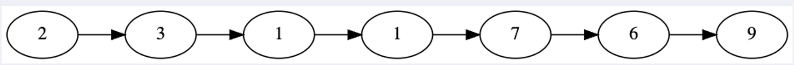
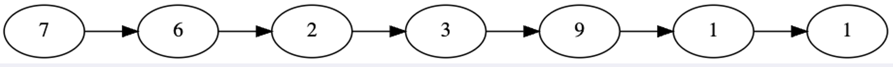
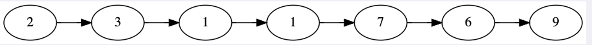

# Arrays/Linked Lists

## Assignment Instructions

We’ve supplied you with a **_Node_** class and a constructor for the **_LinkedList_** class. Here are descriptions of the methods you should write for instances of **_LinkedList_**:

**_push(val) :_** Appends a new node with value **_val_** to the tail. Returns undefined.

**_unshift(val) :_** Add a new node with value **_val_** to the head. Returns undefined.

**_pop() :_** Remove & return tail value. Throws error if list is empty.

**_shift() :_** Remove & return head value. Throws error if list is empty.

**_getAt(idx) :_** Retrieve value at index position **_idx_**. Throws error if index is invalid.

**_setAt(idx, val) :_** Set value of node at index position **_idx_** to **_val_**. Throws error if index is invalid.

**_insertAt(idx, val) :_** Insert a new node at position **_idx_** with value **_val_**. Throws error if index is invalid. Returns undefined.

**_removeAt(idx) :_** Remove & return value at position **_idx_**. Throws error if index is invalid.

Warning: Go Slow & Check Your Code! It’s very easy to make methods that don’t work for every case — make sure you properly handle cases of items being at the start, middle, or end of the list, as well as handling empty lists.

## **Average Of List**

Given a linked list containing numbers, return the average of those numbers.

For example:



would return 4.142857142857143.

## **Further Study**

### **Doubly Linked Lists**

Doubly Linked Lists are just like Singly Linked Lists, but each node has a pointer to the previous node as well as the next one. Implement a class for **_DoublyLinkedList_** with the same methods as above (be mindful of opportunities to speed up your code now that each node has two pointers!)

### **Reverse In Place**

Write a function that reverses a linked list *in place* — not by creating a new list or new nodes.

### **Sort Sorted Linked Lists**

Write a function that is passed two linked lists, **_a_** and **_b_**, both of which are already sorted.

It should return a *new* linked list, in sorted order.

### **Pivot Around Value**

Imagine we have a singly-linked linked list:



In this challenge, you’ll be given a value and you want to rearrange the items in the linked list so that all items with data less than the given value are in the first half, and items with greater than or equal to the given value are in the second half.

For example, for the value 5:



Notice that this list isn’t sorted; all we need to do is “pivot” it around the given value. Otherwise, items are still in the same order as they were (7 came before 6 in the original list, so it still does — but both of them are greater than 5, so they appear in the second half).

For example:

```
let ll = new LinkedList([7, 6, 2, 3, 9, 1, 1])

ll.pivot(5)

// now list is 2 3 1 1 7 6 9
```

If the given pivot value is in the list, it should appear in the second half (with other greater-than-or-equal-to values):

```
let ll = new LinkedList([7, 6, 2, 5, 3, 5, 9, 1, 1])

ll.pivot(5)

//  now list is 2 3 1 1 7 6 5 5 9
```

### **Circular Arrays**

In this challenge, you will create a “circular array” — like a list ADT but the end wraps around to the beginning (which makes for some interesting problems).

A circular array is defined by having a start and indexes (be sure to think about **optimizing runtime** for indexing, since we’ll do this so much more often than adding items to it):

```
let circ = new CircularArray()
circ.addItem('harry')
circ.addItem('hermione')
circ.addItem('ginny')
circ.addItem('ron')

circ.printArray()
// harry
// hermione
// ginny
// ron

circ.getByIndex(2)  // ginny
circ.getByIndex(15) // null
```

Because the last item circles back around to the first item, you can rotate the list and shift the indexes. Positive numbers rotate the list start (defined as the index 0) to the right (or higher indexes):

```
let circ = new CircularArray()
circ.addItem('harry')
circ.addItem('hermione')
circ.addItem('ginny')
circ.addItem('ron')

circ.rotate(1)
circ.printArray()
// hermione
// ginny
// ron
// harry

circ.getByIndex(2)  // ron
```

And negative numbers rotate the list start to the left (or lower indexes):

```
let circ = new CircularArray()
circ.addItem('harry')
circ.addItem('hermione')
circ.addItem('ginny')
circ.addItem('ron')

circ.rotate(-1)
circ.printArray()
// ron
// harry
// hermione
// ginny

circ.getByIndex(2)  // hermione
```

And you can also rotate more than once around the ring:

```
let circ = new CircularArray()
circ.addItem('harry')
circ.addItem('hermione')
circ.addItem('ginny')
circ.addItem('ron')

circ.rotate(-17)
circ.getByIndex(1)  // harry
```

If you add a new item after rotating, it should go at the end of the list in its current rotation:

```
let circ = new CircularArray()
circ.addItem('harry')
circ.addItem('hermione')
circ.addItem('ginny')
circ.addItem('ron')

circ.rotate(-2)
circ.addItem('dobby')

circ.printArray()
// ginny
// ron
// harry
// hermione
// dobby
```

## Assignment Context

The `Node` and `LinkedList` classes work together to implement a singly linked list data structure. Here's a breakdown of how they interact and what each part does:

### `Node` Class

The `Node` class represents an individual element in the linked list. Each node contains:

- `val`: The value stored in the node.
- `next`: A reference to the next node in the list (initially null).

### `LinkedList` Class

The `LinkedList` class manages a sequence of `Node` instances. It contains:

- `head`: The first node in the list.
- `tail`: The last node in the list.
- `length`: The number of nodes in the list.

The constructor initializes an empty list and optionally populates it with an array of values by calling the `push` method for each value.

### Methods

- `push(val)`: Adds a new node with value val to the end of the list.
- `unshift(val)`: Adds a new node with value val to the start of the list.
- `pop()`: Removes and returns the last node's value.
- `shift()`: Removes and returns the first node's value.
- `getAt(idx)`: Retrieves the value at the specified index.
- `setAt(idx, val)`: Sets the value of the node at the specified index to val.
- `insertAt(idx, val)`: Inserts a new node with value val at the specified index.
- `removeAt(idx)`: Removes and returns the value of the node at the specified index.
- `average()`: Returns the average of all values in the list.

### Example

Here's an example of how the `Node` and `LinkedList` classes work together:

```
let list = new LinkedList();
list.push(10); // Adds a node with value 10
list.push(20); // Adds a node with value 20
list.unshift(5); // Adds a node with value 5 at the start

console.log(list.head.val); // 5
console.log(list.tail.val); // 20
console.log(list.length); // 3
```

In this example:

- The list starts empty.
- push(10) adds a node with value 10.
- push(20) adds a node with value 20.
- unshift(5) adds a node with value 5 at the start.
- The list now contains nodes with values 5 -> 10 -> 20.

## How I set up this project. 

1. Install dependencies with the command `npm install`.
   - This command will read the `package.json` file and install all the dependencies listed under `dependencies` and `devDependencies`.

2. Run the `linked-list.js` Script: If you want to run the `linked-list.js` script directly, you can use Node.js. In your terminal, run: `node linked-list.js`.
   - Ensure that `linked-list.js` has a proper entry point (e.g., a function call or some executable code) to see the output.

3. Run the Tests: To run the tests defined in `linked-list.test.js`, you can use the `jest` testing framework. Since `jest` is listed as a dev dependency in your `package.json`, you can run the tests using: `npm test`.
   - This command will execute the `jest` command as defined in the `scripts` section of your `package.json`.


## My Solutions Explained

### `push(val)`

- Line 1: The `push` method is defined, which takes a single parameter `val`.
- Line 2: A new instance of the `Node` class is created with the value `val` and assigned to the variable `newNode`.
- Line 3: The method checks if the list is empty by checking if `this.head` is `null` or `undefined`.
- Line 4: If the list is empty (`this.head` is `null`), it sets both `this.head` and `this.tail` to the new node, making it the first and only node in the list.
- Line 5: If the list is not empty, it sets the `next` property of the current `tail` node to the new node, linking the new node to the end of the list.
- Line 6: It then updates `this.tail` to be the new node, making it the new last node in the list.
- Line 7: The length of the list is incremented by 1 to reflect the addition of the new node.

```
//The push method is defined, which takes a single parameter val.
push(val) {
    //A new instance of the Node class is created with the value val and assigned to the variable newNode.
    const newNode = new Node(val);

    //The method checks if the list is empty by checking if this.head is null or undefined.
    if (!this.head) {
      //If the list is empty (this.head is null), it sets both this.head and this.tail to the new node, making it the first and only node in the list.
      this.head = newNode;
      this.tail = newNode;
    } else {
      //If the list is not empty, it sets the next property of the current tail node to the new node, linking the new node to the end of the list.
      this.tail.next = newNode;
      //It then updates this.tail to be the new node, making it the new last node in the list.
      this.tail = newNode;
    }

    //The length of the list is incremented by 1 to reflect the addition of the new node.
    this.length++;
  }
```

---

### `unshift(val)`

- Line 1: The `unshift` method is defined, which takes a single parameter `val`.
- Line 2: A new instance of the `Node` class is created with the value `val` and assigned to the variable `newNode`. This new node will be added to the start of the list.
- Line 3: The method checks if the list is empty by checking if `this.head` is `null` or `undefined`.
- Line 4: If the list is empty (`this.head` is `null`), it sets both `this.head` and `this.tail` to the new node, making it the first and only node in the list.
- Line 5: If the list is not empty, it sets the `next` property of the new node to the current `head` node, linking the new node to the start of the list.
- Line 6: It then updates `this.head` to be the new node, making it the new first node in the list.
- Line 7: The length of the list is incremented by 1 to reflect the addition of the new node.

```
//The unshift method is defined, which takes a single parameter val.
unshift(val) {
    //A new instance of the Node class is created with the value val and assigned to the variable newNode. This new node will be added to the start of the list.
    const newNode = new Node(val);
    //The method checks if the list is empty by checking if this.head is null or undefined.
    if (!this.head) {
      //If the list is empty (this.head is null), it sets both this.head and this.tail to the new node, making it the first and only node in the list.
      this.head = newNode;
      this.tail = newNode;
    } else {
      //If the list is not empty, it sets the next property of the new node to the current head node, linking the new node to the start of the list.
      newNode.next = this.head;
      //It then updates this.head to be the new node, making it the new first node in the list.
      this.head = newNode;
    }

    //The length of the list is incremented by 1 to reflect the addition of the new node.
    this.length++;
  }
```

---

### `pop()`

- Line 1: The `pop` method is defined with no parameters.
- Line 2: It checks if the list is empty by checking if `this.head` is `null` or `undefined`. If the list is empty, it throws an error indicating that the list is empty.
- Line 3: A variable `current` is initialized to the head of the list. This will be used to traverse the list.
- Line 4: A variable `previous` is initialized to `null`. This will keep track of the node before the `current` node during traversal.
- Line 5: A `while` loop is used to traverse the list until it reaches the last node (where `current.next` is `null`).
- Line 6: Inside the loop, `previous` is updated to the current node.
- Line 7: `current` is updated to the next node in the list.
- Line 8: After the loop, it checks if `previous` is not `null`, which means the list has more than one node.
- Line 9: If `previous` is not `null`, it sets `previous.next` to `null`, effectively removing the last node from the list.
- Line 10: It then updates `this.tail` to `previous`, making the second-to-last node the new tail of the list.
- Line 11: If `previous` is `null`, it means the list had only one node.
- Line 12: In this case, it sets both `this.head` and `this.tail` to `null`, making the list empty.
- Line 13: The length of the list is decremented by 1 to reflect the removal of the node.
- Line 14: The method returns the value of the removed node (`current.val`).

```
//The pop method is defined with no parameters.
pop() {
    //It checks if the list is empty by checking if this.head is null or undefined. If the list is empty, it throws an error indicating that the list is empty.
    if (!this.head) throw new Error("List is empty");

    //A variable current is initialized to the head of the list. This will be used to traverse the list.
    let current = this.head;
    // A variable previous is initialized to null. This will keep track of the node before the current node during traversal.
    let previous = null;

    //A while loop is used to traverse the list until it reaches the last node (where current.next is null).
    while (current.next) {
      //Inside the loop, previous is updated to the current node.
      previous = current;
      //current is updated to the next node in the list.
      current = current.next;
    }

    //After the loop, it checks if previous is not null, which means the list has more than one node.
    if (previous) {
      //If previous is not null, it sets previous.next to null, effectively removing the last node from the list.
      previous.next = null;
      //It then updates this.tail to previous, making the second-to-last node the new tail of the list.
      this.tail = previous;
    } else {  //If previous is null, it means the list had only one node.
      //In this case, it sets both this.head and this.tail to null, making the list empty.
      this.head = null;
      this.tail = null;
    }
    //The length of the list is decremented by 1 to reflect the removal of the node.
    this.length--;
    //The method returns the value of the removed node (current.val).
    return current.val;
  }
```

---

### `shift()`

- Line 1: Checks if the list is empty. If `this.head` is `null`, it means the list is empty. In this case, an error is thrown.
- Line 2: Stores the current head node. The current head node is stored in the `removedNode` variable. This node will be removed from the list.
- Line 3: Updates the head to the next node. The `head` is updated to point to the next node in the list. This effectively removes the first node from the list.
- Line 4: Checks if the list is now empty. If the `head` is `null` after the update, it means the list is now empty. In this case, the `tail` is also set to `null`.
- Line 5: Decreases the length of the list. The `length` property is decremented by 1 to reflect the removal of a node.
- Line 6: Returns the value of the removed node. The value of the removed node is returned. This allows the caller to know what value was removed from the list.

```
shift() {
  // Check if the list is empty by verifying if the head is null.
  // If the list is empty, throw an error.
  if (!this.head) throw new Error("List is empty");

  // Store the current head node in a variable called removedNode.
  const removedNode = this.head;

  // Update the head to be the next node in the list.
  // This effectively removes the first node from the list.
  this.head = this.head.next;

  // If the list is now empty (i.e., head is null after the update),
  // set the tail to null as well.
  if (!this.head) {
    this.tail = null;
  }

  // Decrease the length of the list by 1.
  this.length--;

  // Return the value of the removed node.
  return removedNode.val;
}
```

---

### `getAt(idx)`

- Line 1: Checks if the index is out of bounds.
  - This line checks if the provided index is less than 0 or greater than or equal to the length of the list. If it is, an error is thrown because the index is invalid.
- Line 2: Initializes the traversal variables.
  - `current` is initialized to the head of the list. This variable will be used to traverse the list.
  - `count` is initialized to 0. This counter will keep track of the current index as we traverse the list.
- Line 3: Traverses the list until the desired index is reached.
  - This loop continues as long as `current` is not `null` and `count` is less than the provided index.
  - Inside the loop, `current` is updated to point to the next node in the list, and `count` is incremented by 1.
- Line 4: Returns the value of the node at the specified index.
  - After the loop, `current` points to the node at the specified index. The value of this node is returned.

```
getAt(idx) {
  // Check if the index is out of bounds.
  // If the index is less than 0 or greater than or equal to the length of the list, throw an error.
  if (idx < 0 || idx >= this.length) {
    throw new Error("Index is invalid");
  }

  // Initialize a variable 'current' to the head of the list.
  // This will be used to traverse the list.
  let current = this.head;

  // Initialize a counter 'count' to 0.
  // This will keep track of the current index as we traverse the list.
  let count = 0;

  // Traverse the list until we reach the desired index.
  // Continue looping while 'current' is not null and 'count' is less than the index.
  while (current !== null && count < idx) {
    // Move to the next node.
    current = current.next;

    // Increment the counter.
    count++;
  }

  // Return the value of the node at the specified index.
  return current.val;
}
```

---

### `setAt(idx, val)`

- Line 1: Checks if the index is out of bounds.
  - This line checks if the provided index is less than 0 or greater than or equal to the length of the list. If it is, an error is thrown because the index is invalid.
- Line 2: Initialize the traversal variables.
  - `current` is initialized to the head of the list. This variable will be used to traverse the list.
  - `count` is initialized to 0. This counter will keep track of the current index as we traverse the list.
- Line 3: Traverses the list until the desired index is reached.
  - This loop continues as long as `current` is not `null` and `count` is less than the provided index.
  - Inside the loop, `current` is updated to point to the next node in the list, and `count` is incremented by 1.
- Line 4: Sets the value of the node at the specified index to the new value.
  - After the loop, `current` points to the node at the specified index. The value of this node is set to the new value provided.
- Line 5: Returns an object with the index and the new value.
  - This line returns an object containing the index and the new value, indicating that the value at the specified index has been successfully updated.

```
setAt(idx, val) {
  // Check if the index is out of bounds.
  // If the index is less than 0 or greater than or equal to the length of the list, throw an error.
  if (idx < 0 || idx >= this.length) {
    throw new Error("Index is invalid");
  }

  // Initialize a variable 'current' to the head of the list.
  // This will be used to traverse the list.
  let current = this.head;

  // Initialize a counter 'count' to 0.
  // This will keep track of the current index as we traverse the list.
  let count = 0;

  // Traverse the list until we reach the desired index.
  // Continue looping while 'current' is not null and 'count' is less than the index.
  while (current !== null && count < idx) {
    // Move to the next node.
    current = current.next;

    // Increment the counter.
    count++;
  }

  // Set the value of the node at the specified index to the new value.
  current.val = val;

  // Return an object with the index and the new value.
  return { idx: idx, val: val };
}
```

---

### `insertAt(idx, val)`

- Line 1: Checks if the index is out of bounds. 
  - This line checks if the provided index is less than 0 or greater than the length of the list. If it is, an error is thrown because the index is invalid.
- Line 2: Creates a new node with the given value.
  - This line creates a new instance of the `Node` class with the provided value.
- Line 3: Inserts the new node at the head if the index is 0.
  - If the index is 0, the new node is inserted at the head of the list.
  - The `next` property of the new node is set to the current head.   
  - The head of the list is updated to be the new node.
  - If the list was empty (length is 0), the tail is also updated to be the new node.
- Line 4: Traverses the list to find the insertion point.
  - If the index is not 0, the list is traversed to find the node just before the desired index.
  - `current` is initialized to the head of the list.
  - `count` is initialized to 0.
  - The loop continues until `count` is one less than the index, moving `current` to the next node and incrementing `count`.
- Line 5: Inserts the new node at the desired index.
  - The `next` property of the new node is set to the next node of the current node.
  - The `next` property of the current node is set to the new node.
  - If the new node is inserted at the end (its `next` is `null`), the tail is updated to be the new node.
- Line 6: Increment the length of the list.
  - The length of the list is incremented by 1.
- Line 7: Returns an object with the index and the new value.
  - This line returns an object containing the index and the new value, indicating that the node has been successfully inserted.

```
insertAt(idx, val) {
  // Check if the index is out of bounds.
  // If the index is less than 0 or greater than the length of the list, throw an error.
  if (idx < 0 || idx > this.length) {
    throw new Error("Index is invalid");
  }

  // Create a new node with the given value.
  const newNode = new Node(val);

  // If the index is 0, insert the new node at the head of the list.
  if (idx === 0) {
    // Set the next property of the new node to the current head.
    newNode.next = this.head;

    // Update the head to be the new node.
    this.head = newNode;

    // If the list was empty, also update the tail to be the new node.
    if (this.length === 0) {
      this.tail = newNode;
    }
  } else {
    // Initialize a variable 'current' to the head of the list.
    // This will be used to traverse the list.
    let current = this.head;

    // Initialize a counter 'count' to 0.
    // This will keep track of the current index as we traverse the list.
    let count = 0;

    // Traverse the list until we reach the node just before the desired index.
    while (count < idx - 1) {
      // Move to the next node.
      current = current.next;

      // Increment the counter.
      count++;
    }

    // Set the next property of the new node to the next node of the current node.
    newNode.next = current.next;

    // Set the next property of the current node to the new node.
    current.next = newNode;

    // If the new node is inserted at the end, update the tail to be the new node.
    if (newNode.next === null) {
      this.tail = newNode;
    }
  }

  // Increment the length of the list.
  this.length++;

  // Return an object with the index and the new value.
  return { idx: idx, val: val };
}
```

---

### `removeAt(idx)`

- Line 1: Checks if the index is out of bounds.
  - This line checks if the provided index is less than 0 or greater than or equal to the length of the list. If it is, an error is thrown because the index is invalid.
- Line 2: Initializes a variable to store the node that will be removed.
  - This line declares a variable `removedNode` to store the node that will be removed from the list.
- Line 3: Removes the head node if the index is 0.
  - If the index is 0, the head node is removed.
  - The current head node is stored in `removedNode`.
  - The head of the list is updated to be the next node.
  - If the list had only one node (length is 1), the tail is also updated to be `null`.
- Line 4: Traverses the list to find the node just before the desired index.
  - If the index is not 0, the list is traversed to find the node just before the desired index.
  - `current` is initialized to the head of the list.
  - `count` is initialized to 0.
  - The loop continues until `count` is one less than the index, moving `current` to the next node and incrementing `count`.
- Line 5: Removes the node at the desired index.
  - The node to be removed is stored in `removedNode`.
  - The `next` property of the current node is updated to skip the removed node.
  - If the removed node was the tail (its `next` is `null`), the tail is updated to be the current node.
- Line 6: Decrements the length of the list.
  - The length of the list is decremented by 1.
- Line 7: Returns an object with the index and the value of the removed node.
  - This line returns an object containing the index and the value of the removed node, indicating that the node has been successfully removed.

```
removeAt(idx) {
  // Check if the index is out of bounds.
  // If the index is less than 0 or greater than or equal to the length of the list, throw an error.
  if (idx < 0 || idx >= this.length) {
    throw new Error("Index is invalid");
  }

  // Initialize a variable to store the node that will be removed.
  let removedNode;

  // If the index is 0, remove the head node.
  if (idx === 0) {
    // Store the current head node in removedNode.
    removedNode = this.head;

    // Update the head to be the next node.
    this.head = this.head.next;

    // If the list had only one node, update the tail to be null.
    if (this.length === 1) {
      this.tail = null;
    }
  } else {
    // Initialize a variable 'current' to the head of the list.
    // This will be used to traverse the list.
    let current = this.head;

    // Initialize a counter 'count' to 0.
    // This will keep track of the current index as we traverse the list.
    let count = 0;

    // Traverse the list until we reach the node just before the desired index.
    while (count < idx - 1) {
      // Move to the next node.
      current = current.next;

      // Increment the counter.
      count++;
    }

    // Store the node to be removed in removedNode.
    removedNode = current.next;

    // Update the next property of the current node to skip the removed node.
    current.next = removedNode.next;

    // If the removed node was the tail, update the tail to be the current node.
    if (removedNode.next === null) {
      this.tail = current;
    }
  }

  // Decrement the length of the list.
  this.length--;

  // Return an object with the index and the value of the removed node.
  return { idx: idx, val: removedNode.val };
}
```

---

### `average()`

- Line 1: Checks if the list is empty.  
  - This line checks if the length of the list is 0, which means the list is empty. If it is, the method returns `0` because there are no values to average.
- Line 2: Initializes a variable to store the sum of all node values.
  - This line declares a variable `total` and initializes it to `0`. This variable will be used to accumulate the sum of all node values in the list.
- Line 3: Initializes a variable current to the head of the list.
  - This line declares a variable `current` and initializes it to the head of the list. This variable will be used to traverse the list.
- Line 4: Traverse the list until the end.
  - This `while` loop continues as long as `current` is not `null`.
  - Inside the loop, the value of the current node (`current.val`) is added to `total`.
  - The `current` variable is then updated to point to the next node in the list (`current.next`).
- Line 5: Calculate the average by dividing the total sum by the length of the list.
  - After the loop has finished traversing the list, this line calculates the average by dividing the `total` sum by the `length` of the list.
  - The result is returned as the average value of all the nodes in the list.


```
average() {
  // Check if the list is empty. If it is, return 0.
  if (this.length === 0) return 0;

  // Initialize a variable to store the sum of all node values.
  let total = 0;

  // Initialize a variable 'current' to the head of the list.
  // This will be used to traverse the list.
  let current = this.head;

  // Traverse the list until the end.
  while (current) {
    // Add the value of the current node to the total sum.
    total += current.val;

    // Move to the next node.
    current = current.next;
  }

  // Calculate the average by dividing the total sum by the length of the list.
  return total / this.length;
}
```

### Further refactors

`initializeIfEmpty`

To eliminate redundant code, I created a helper method `initializeIfEmpty` that will handle the initialization of the list when it is empty. This method can be used in both the `push` and `unshift` methods. Here is the refactored code:

```
initializeIfEmpty(newNode) {
    if (!this.head) {
      this.head = newNode;
      this.tail = newNode;
      return true;
    }
    return false;
  }
```